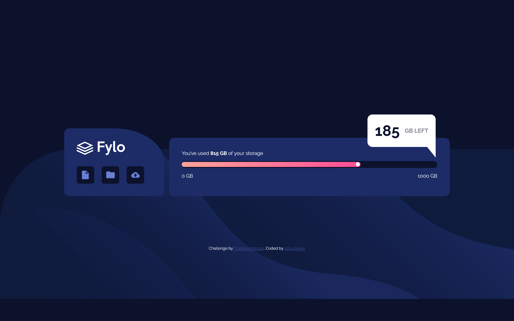

# Frontend Mentor - Fylo data storage component solution

This is a solution to the [Fylo data storage component challenge on Frontend Mentor](https://www.frontendmentor.io/challenges/fylo-data-storage-component-1dZPRbV5n). Frontend Mentor challenges help you improve your coding skills by building realistic projects. 

## Table of contents

- [Overview](#overview)
  - [The challenge](#the-challenge)
  - [Screenshot](#screenshot)
  - [Links](#links)
  - [Built with](#built-with)
  - [What I learned](#what-i-learned)

- [Author](#author)


## Overview

### The challenge

Users should be able to:

- View the optimal layout for the site depending on their device's screen size


### Screenshot




### Links

- Solution URL: [Add solution URL here](https://www.frontendmentor.io/challenges/fylo-data-storage-component-1dZPRbV5n/hub/fylo-data-storage-component-82GK-tyrY)
- Live Site URL: [Add live site URL here](https://your-live-site-url.com)


### Built with

- Semantic HTML5 markup
- CSS custom properties
- Flexbox
- CSS Grid
- Mobile-first workflow


### What I learned

```HTML
 <ul>
          <li>
            
          </li>
          <li>
            
          </li>
          <li area-label="upload">
            
          </li>
        </ul>


```
```css

ul {
    list-style: none;
    display: flex;

    li {
        background-color: $Very-Dark-Blue;
        width: 3.5em;
        height: 3.5em;
        display: flex;
        justify-content: center;
        align-items: center;
        margin-right: 1.5em;
        border-radius: 0.5rem;
    }
}

/* Triangle */
.float::after {
  content: '';
  position: absolute;
  bottom: -30px;
  right: 0;
  border-style: solid;
  border-width: 0 40px 50px 0;
  border-color: transparent white transparent transparent;
}

```


## Author

- Website - [Azrul Naim](https://sjtape.github.io/)
- Frontend Mentor - [@sjtape](https://www.frontendmentor.io/profile/sjtape)
- Twitter - [@solitaryjester](https://twitter.com/solitaryjester)
- Facebook - [Azrul Naim](https://www.facebook.com/solitary69jester)
- Youtube - [Solitary Jester](https://www.youtube.com/channel/UCkoYmybPTWO92AnRl-q3hig)


